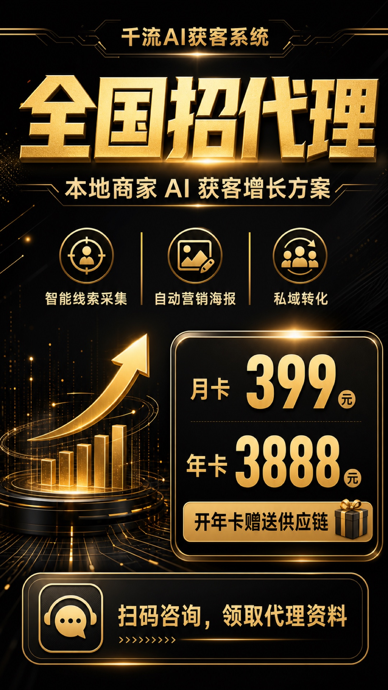
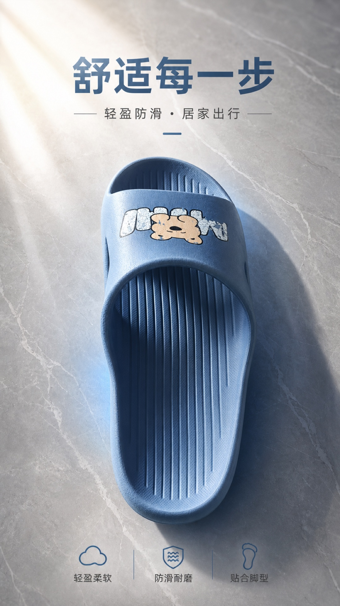
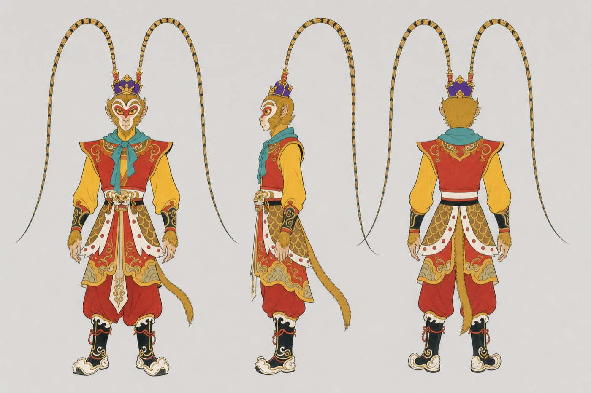
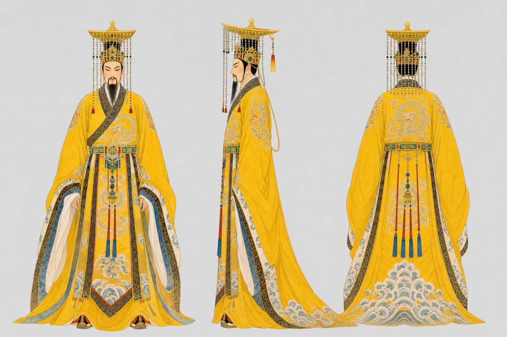
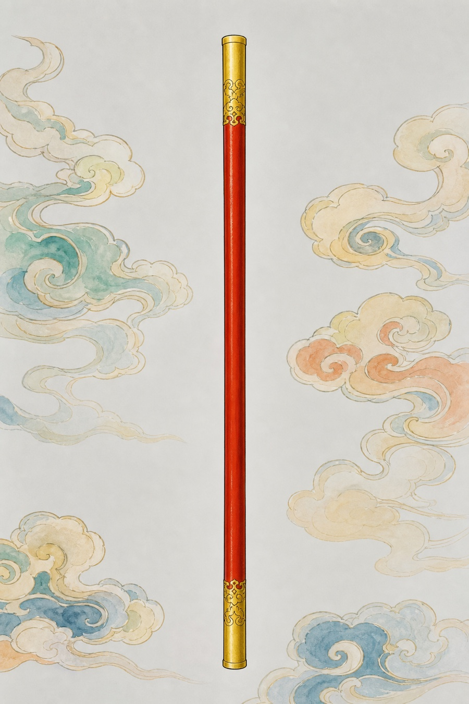

# ImageUltra · 单机版 AI 生图工作台

**纯单机 AI 生图桌面应用**（Tauri 2 + React）：营销海报、实物图海报、AI 修图、证件照、角色三视图、定妆照、道具库，一个安装包全搞定。
没有后端、没有账号、没有数据库服务——除了调用你配置的 OpenAI 兼容生图接口之外，一切都在本机完成。

## 效果展示

**营销海报**（ImageUltra 实测生成：无实物图模式，行业/场景/风格/文案表单直接出成品，中文排版零错字）：

| 开业海报 · 小红书清新 | 招商海报 · 黑金商务 |
| --- | --- |
|  |  |

**更多海报示例**（同管线：左=无实物图，右=有实物图·产品照出海报）：

| 果饮招商 · 高科技感 | 产品海报 · 简约高级 |
| --- | --- |
|  |  |

**三视图**（正/侧/背同一角色、装束配件一件不漏，1961 美影厂工笔重彩画风）：

| 三视图 · 孙悟空 | 三视图 · 玉帝 |
| --- | --- |
|  |  |

**场景设定图 与 道具库单体参考图**：




## 功能

| 模式 | 说明 | 上游路线 |
| --- | --- | --- |
| 无实物图 | 按 行业级联 · 场景 · 风格 · 版式 · 相机质感 · 文案表单 智能生成营销海报，内置全行业文案模板库（换一套） | `gpt-image-*` → `/v1/images/generations`；`gpt-5.x` → `/v1/responses`（流式） |
| 有实物图 | 上传 1~3 张产品照片生成海报：单张=单品海报，多张=产品合集海报；可选"看图策划"（gpt-5.x 先看图写文案再出图）与"读取图中文案"（视觉模型 OCR 回填） | `/v1/images/edits`，`input_fidelity=high` 保真原图 |
| AI 修图 | 一句话修图：变瘦 / 老照片修复 / 变清晰 / 美颜 / 换底 / 双图合成加产品，尺寸自动跟随原图朝向 | `/v1/images/edits` |
| 证件照 | 人像换 白/蓝/红 底 + 标准免冠构图，本地 canvas 精确裁切到 一寸/二寸/小一寸/小二寸/大一寸 像素 | `/v1/images/edits` + 本地后处理 |
| 三视图 | 角色 正/侧/背 三视设定图（同一人、装束配件一件不漏）；可顺便把武器画进去（自由填 或 从道具库选），可挂已有角色图锁形象 | 纯文生图；挂参考时 `/v1/images/edits` |
| 定妆照 | 角色正面全身立绘（定妆照），锁定形象用；同样支持带武器、挂角色参考 | 同上 |
| 道具库 | 武器 / 法术 / 道具管理：名称、归属角色、形制描述、用法说明（防"筋斗云拿手里"类歧义），一键生成纯净单体参考图或上传已有图，库存本机；三视图/定妆照可直接挑选挂载 | `/v1/images/generations` |

其余能力：画面比例 8 种 + 1K/2K/4K 清晰度、生成进度与任务状态、失败自动重试、
成品"继续修改"（对话修图）、"存入角色库"（三视图/定妆照沉淀成参考资产）、
本地生成历史（IndexedDB，最多 200 张）、保存 PNG 到本地。

## 提示词全部可改（不写死）

- 三视图 / 定妆照 / 道具图 / 武器附加句 / 挂参考前置说明——五套**提示词模板**都在
  设置 → "提示词模板"里可编辑（`{name}` `{desc}` 等变量占位），改坏一键还原默认。
- 每次生成前，拼装好的**最终提示词**显示在可编辑文本框里，可整段改写；改过后不再被自动覆盖，点"重新拼装"恢复按字段生成。

## 接口配置（界面可配）

首次启动自动弹出设置窗，所有配置保存在本机：

- **接口地址**：默认 `https://claudegpt.org/v1`（可换任何 OpenAI Images 兼容网关，带不带 `/v1` 均可）
- **API Key**：必填，仅存储在本机
- **模型**：文生图 / 图片编辑 / 海报策划 / 识图视觉，默认 `gpt-image-2` × 3 + `gpt-5.5`
- **失败重试次数**：0~3

> 隐私：应用唯一的外部网络请求就是这个生图接口；历史图片、设置、Key 全部只存本机。

## 开发

```bash
npm install
npm run dev          # 纯浏览器开发（接口若无 CORS 会受限，建议用 tauri:dev）
npm run tauri:dev    # 桌面窗口开发（HTTP 走 Rust 侧，无 CORS 限制）
```

需要 Node 18+ 与 Rust 稳定版工具链（https://rustup.rs）。

## 打包

### macOS（.dmg / .app）

```bash
npm install
npm run tauri:build
```

产物：`src-tauri/target/release/bundle/dmg/ImageUltra_0.1.0_aarch64.dmg`（及 `macos/ImageUltra.app`）。

未签名应用首次打开若被 Gatekeeper 拦截：右键 → 打开，或执行
`xattr -cr /Applications/ImageUltra.app`。

### Windows（.exe 安装包）

在 Windows 机器上（需安装 Rust + Node）：

```bash
npm install
npm run tauri:build
```

产物：`src-tauri/target/release/bundle/nsis/ImageUltra_0.1.0_x64-setup.exe`。

### GitHub Actions 一键出 exe + dmg

仓库已带 `.github/workflows/release.yml`：

- 推送 tag（如 `v0.1.0`）→ 自动构建 **Windows NSIS exe + macOS 通用 dmg**，并创建 Release 草稿；
- 或在 Actions 页面手动 Run workflow → 构建产物挂在 Artifacts 里。

```bash
git tag v0.1.0 && git push origin v0.1.0
```

## 技术说明

- 三条上游路线自动选择：有参考图 → `/v1/images/edits`（`input_fidelity=high` 高保真原图）；
  gpt-image 系列文生图 → `/v1/images/generations`；gpt-5.x 文生图 → `/v1/responses`（流式）。
- 尺寸/质量映射：文生图按画布比例换算并对齐 16 的倍数；edits 端点按比例就近映射
  1024×1536 / 1536×1024 / 1024×1024 三档；1K/2K/4K → low/medium/high。
- 证件照本地 canvas 后处理：覆盖裁切 + 纵向重心 0.42（保住头顶留白），精确到标准像素。
- 三视图/定妆照可挂 角色参考图（锁长相装束）与 道具参考图（锁武器形制）；
  道具带 归属/类型/用法 字段防歧义（如"筋斗云踩在脚下、不是拿在手里"）。
- 桌面端 HTTP 走 `tauri-plugin-http`（Rust reqwest），不受 webview CORS 限制。
- 内置多级行业体系与全行业营销文案模板库，完全离线可用。

## 联系方式

- QQ：89066216
